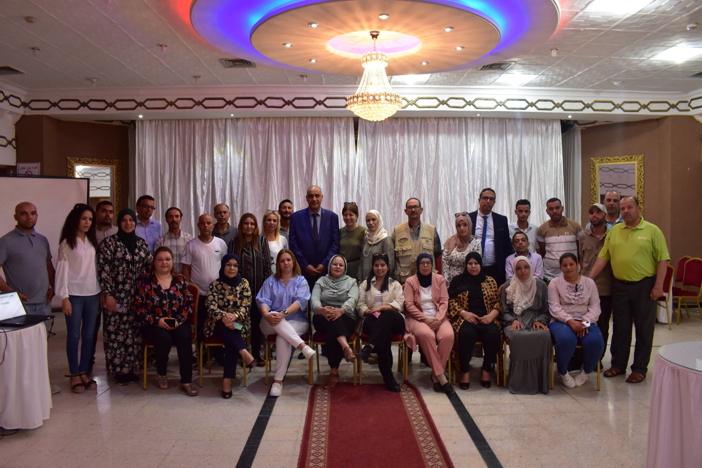
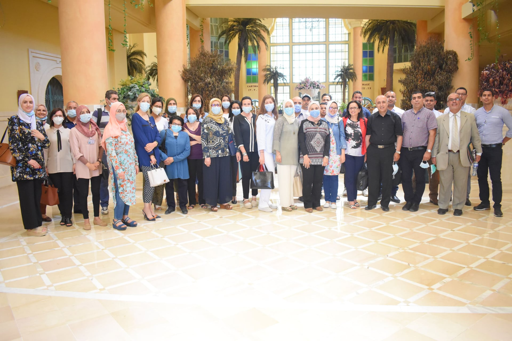
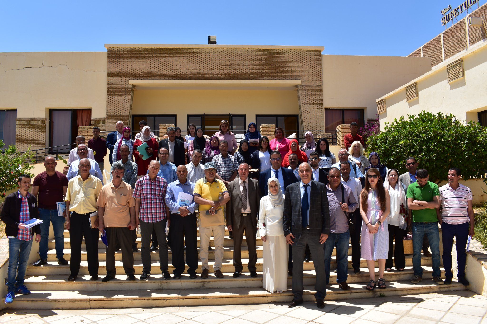
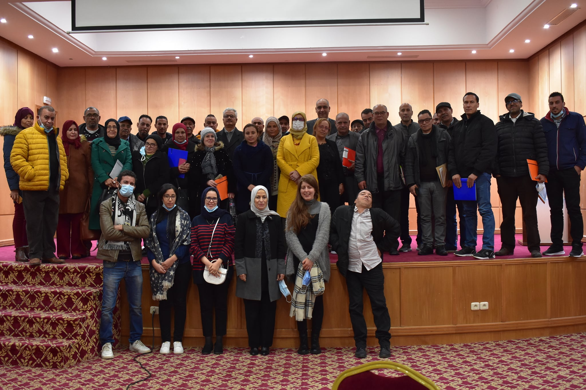

# Qui Sommes Nous !
  
#### L'Institut National de la Santé s’engage à fournir aux intéressés, dans le cadre de collaboration de recherche, des résultats plus détaillés issus du Système d’Information sur les Causes de Décès. Par ailleurs, nous signalons que certains résultats peuvent faire l’objet de mise à jour régulière.
#### Nous demeurons à votre entière disposition pour tout renseignement complémentaire.
  
## Rapport Précis 
  
#### Les rapports antérieurs sur les statistiques nationales des causes de décès sont disponibles :   
<ul>
  <li><a href="insp.pdf">Rapport sur les causes de décés 2020</a></li>
  <li><a href="insp.pdf">Rapport sur les causes de décés 2015 et 2017</a></li>
  <li><a href="insp.pdf">Rapport sur les causes de décés 2013</a></li>
</ul>    
  

# Galerie 
 

  
   
  

 

  
   
  

