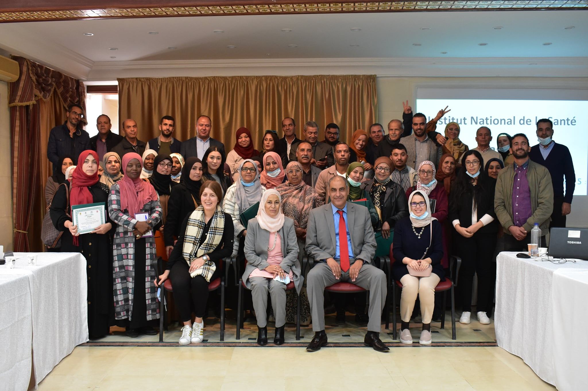

# Qui Sommes Nous !
  
#### L'Institut National de la Santé (NSP)-sous la tutelle du Ministère de la Santé- qui est en charge du Système d'Information sur les Causes de Décès (SICD) conformément au décret n°99-1043 de 1999 et à la Circulaire d'application n°4 de 2000 . Les données concernant les causes de décès sont véhiculées grâce aux Certificat Medical de Décès (CMD).    
#### Ce dernier permet la notification du décès , la précision des caractéristiques du défunt et la certification de la cause initiale , la/les cause(s) intermédiaires(s) et la cause immédiate ayant entrainé le décès.   
#### L’objectif principal de ce projet est de développer l’exploitation de ces données et leur visualisation à l’égard du grand public et des spécialistes 
  
## Rapport Précis 
  
#### Les rapports antérieurs sur les statistiques nationales des causes de décès sont disponibles :   
<ul>
  <li><a href="insp.pdf">Rapport sur les causes de décés 2020</a></li>
  <li><a href="insp.pdf">Rapport sur les causes de décés 2015 et 2017</a></li>
  <li><a href="insp.pdf">Rapport sur les causes de décés 2013</a></li>
</ul>    
  

# Galerie 
 

  
   
  

 

  
   
  

